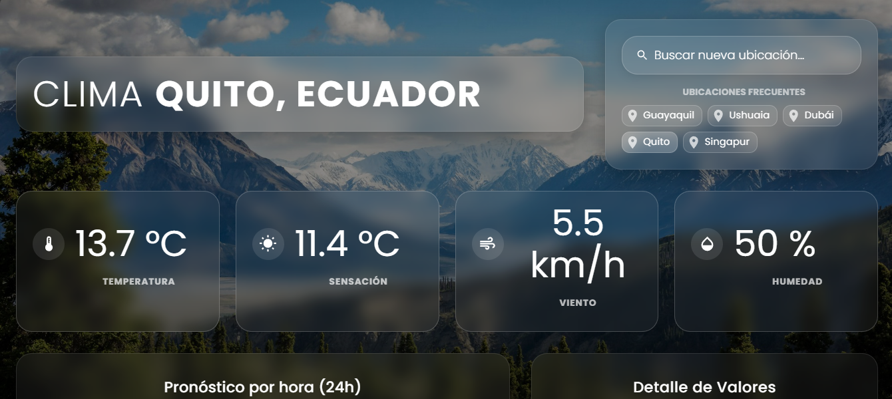

# 🌤️ React Weather Dashboard

🚀 **Live Demo / Ver en vivo:** [https://pablochacon08.github.io/dashboard-react/](https://pablochacon08.github.io/dashboard-react/)

Un panel meteorológico interactivo y en tiempo real diseñado con un enfoque en la experiencia de usuario (UX) y visualización de datos avanzada. Construido con React y Material UI, destaca por su diseño **Glassmorphism** y un motor de renderizado dinámico que adapta la interfaz a las condiciones climáticas exactas de la ubicación seleccionada.

## ✨ Características Principales

*   **Diseño UI/UX Premium:** Interfaz basada en *Glassmorphism* con paneles translúcidos, desenfoque de fondo (backdrop-blur) y diseño 100% responsivo.
*   **Fondos Dinámicos Inteligentes:** El fondo de la aplicación reacciona en tiempo real no solo al estado del clima (lluvia, nieve, tormentas), sino que calcula la sensación térmica para diferenciar visualmente un día despejado caluroso de un día despejado helado.
*   **Visualización de Datos Completa:**
    *   Métricas actuales: Temperatura, Sensación Térmica, Viento y Humedad.
    *   Gráficos interactivos para el pronóstico de las próximas 24 horas.
    *   Tabla de datos detallada con paginación optimizada.
*   **Búsqueda y Accesos Rápidos:** Selector de ubicaciones con ciudades preconfiguradas para probar extremos climáticos (ej. calor extremo en Dubái, nieve en Ushuaia, lluvia extrema en Singapur).
*   **Métricas Adicionales:** Información precisa sobre el amanecer/atardecer, temperaturas máximas/mínimas e Índice UV.

## 🛠️ Tecnologías Utilizadas

*   **Frontend:** React, TypeScript, Vite.
*   **Estilos y Componentes:** Material UI (MUI v5), Emotion.
*   **Visualización de Datos:** Recharts (Gráficos), MUI DataGrid (Tablas de alto rendimiento).
*   **Fuente de Datos:** [Open-Meteo API](https://open-meteo.com/) (Pronósticos meteorológicos precisos y geocodificación).

🏗️ Arquitectura y Lógica Destacada
La lógica de renderizado de imágenes (getWeatherInfo) prioriza eventos climáticos significativos (precipitaciones, tormentas). En ausencia de estos, evalúa la temperatura actual para ajustar la paleta de colores del fondo, ofreciendo una experiencia inmersiva y coherente con la realidad térmica del usuario. Esto soluciona el problema común de las aplicaciones climáticas básicas que muestran paisajes nevados en días soleados pero fríos.

Desarrollado por Josué Pacheco y Pablo Chacón